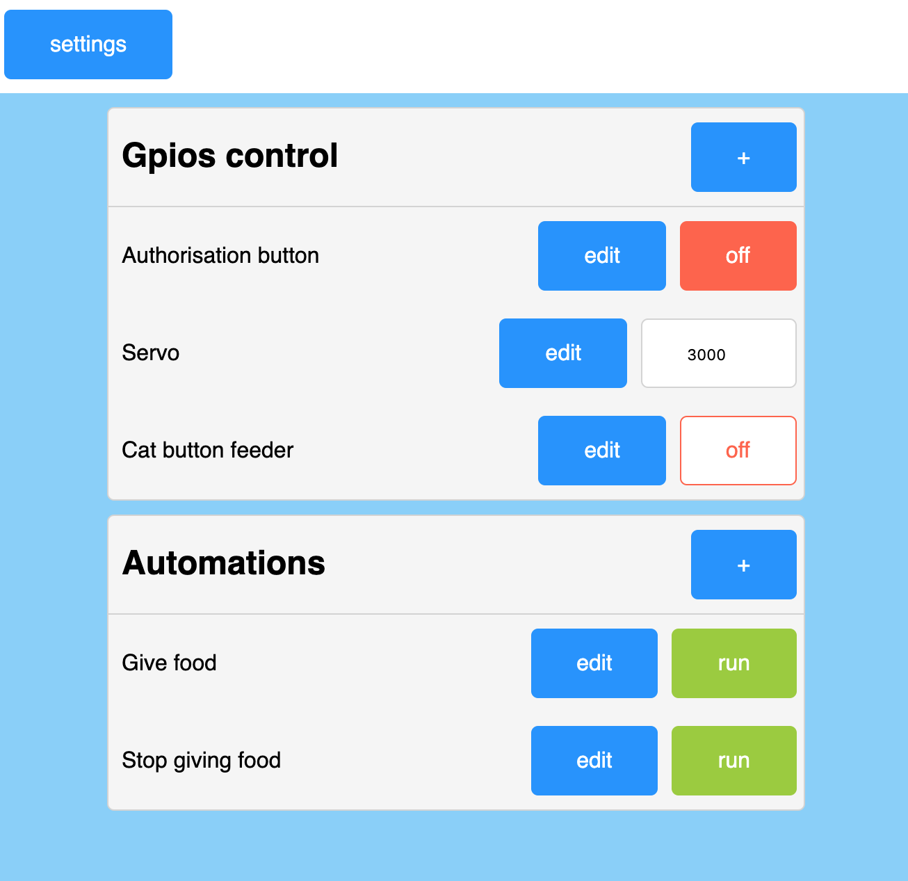
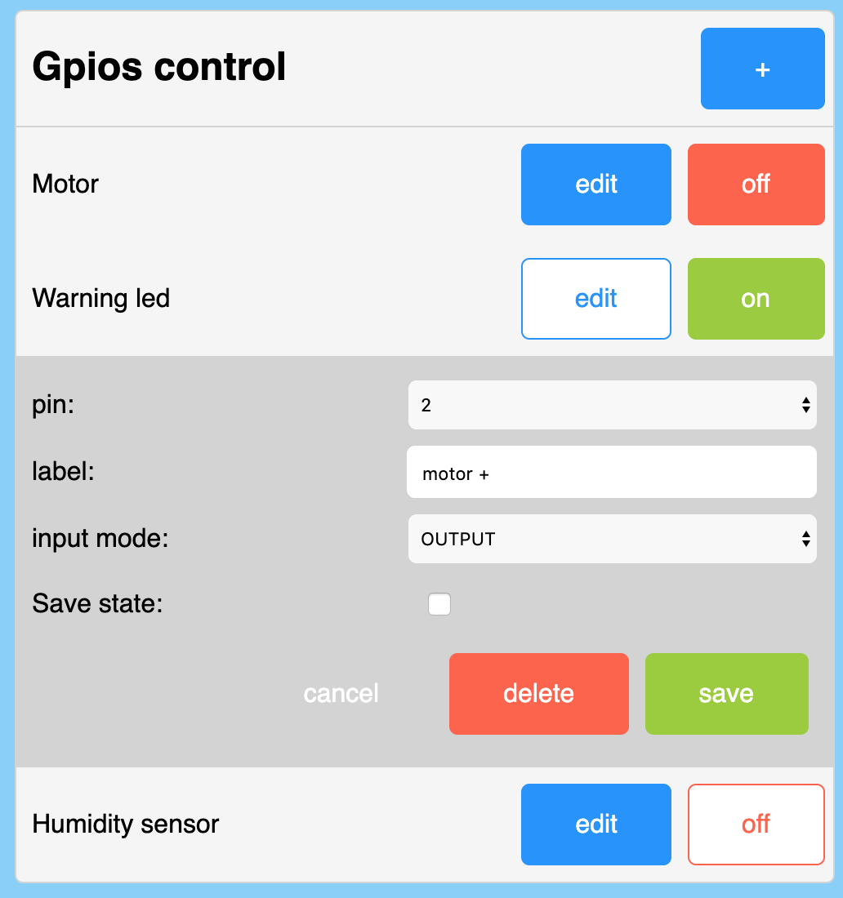
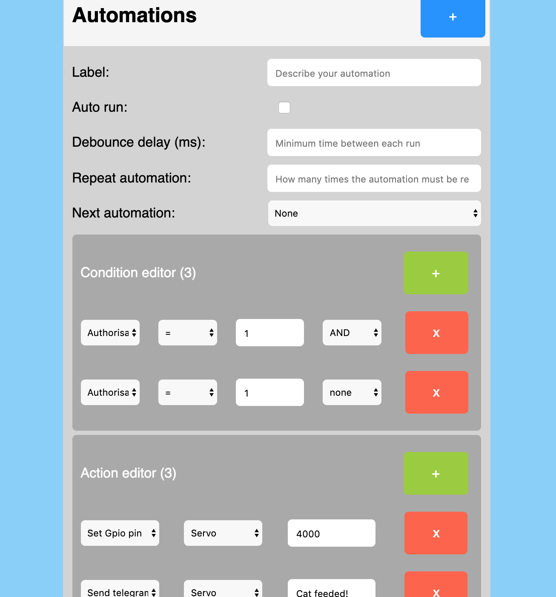
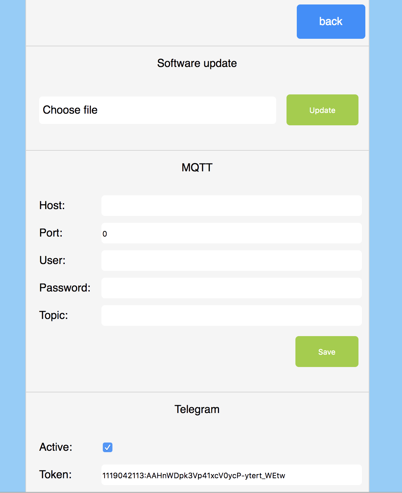
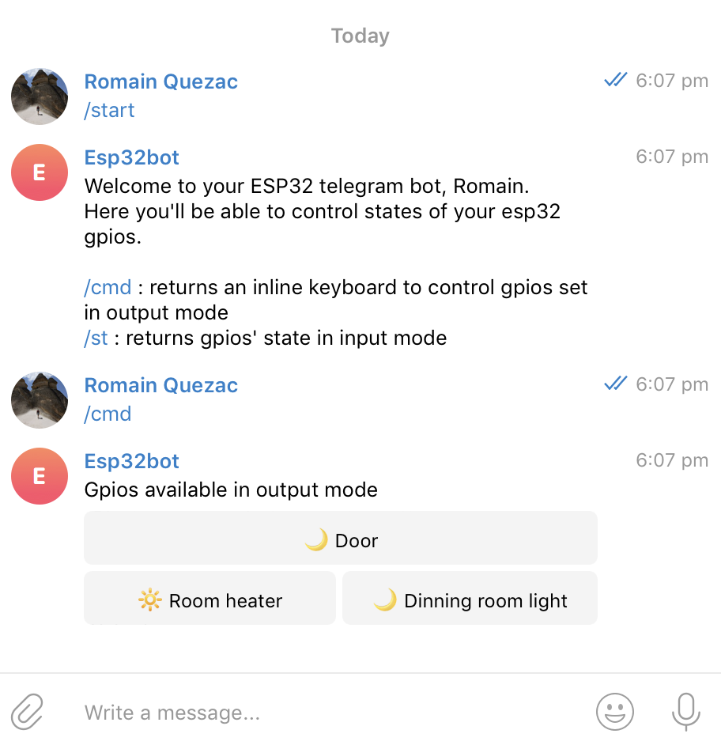
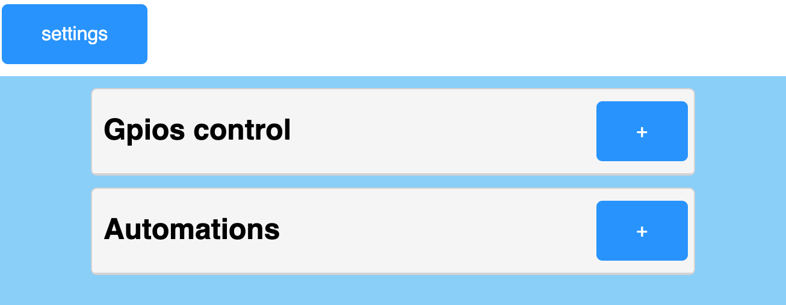
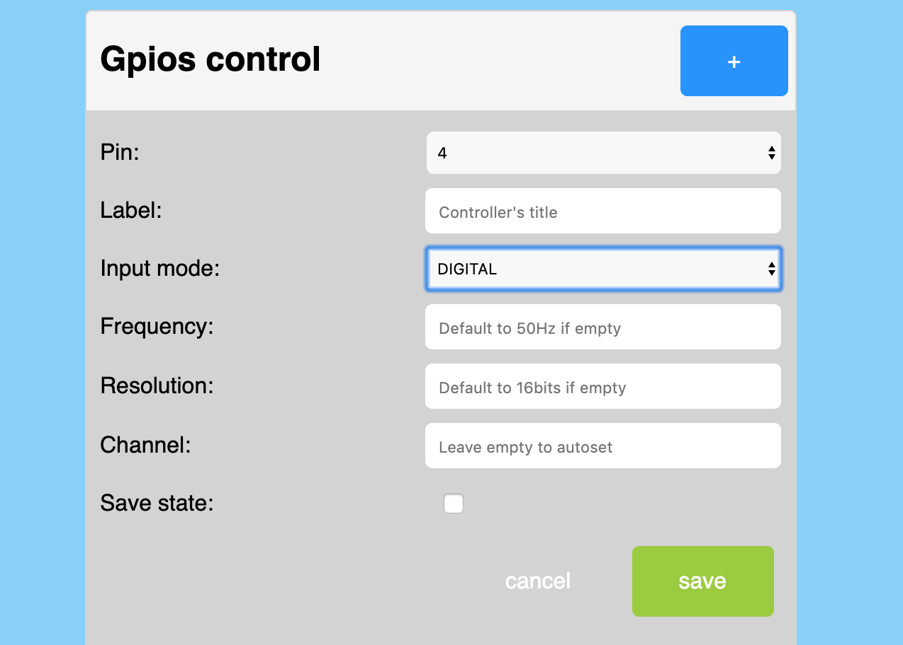
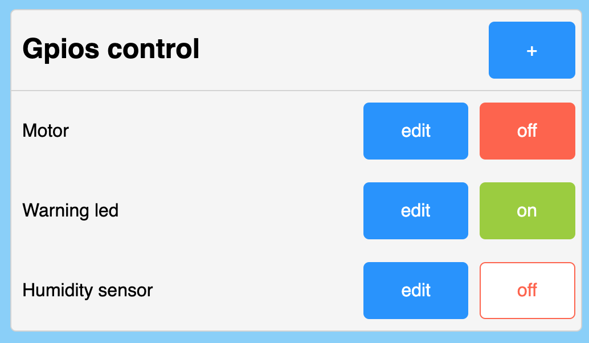
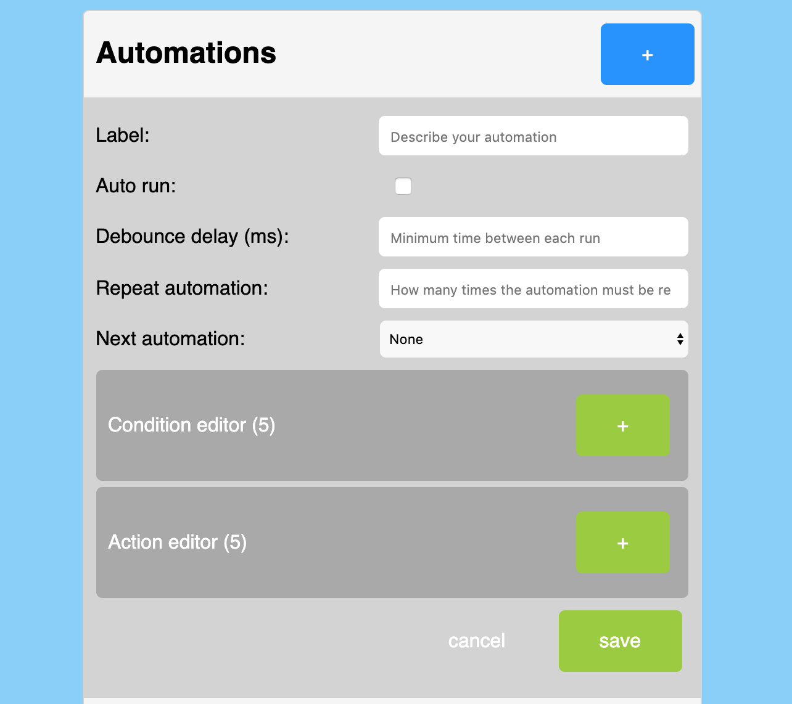

# ESPecial
[](https://app.codacy.com/manual/RomeHein/ESPecial?utm_source=github.com&utm_medium=referral&utm_content=RomeHein/ESPecial&utm_campaign=Badge_Grade_Settings)
[](https://t.me/especial32)

This project aim to provide an easy way to control your esp32. You no longer need programming skills to set complex tasks. This can be a very nice approach for small projects, home automation and/or educational purposes.

Here is a quick video exemple of what you can do with ESPecial:
https://youtu.be/_E-ywkafs94

The event driven web interface:
https://youtu.be/yFqBmNJR02w

An exemple of how you can set the interface to control servo motors with a potentiometer:
https://youtu.be/_ucSs9OT7Eg


## Features:
- [x] Automation: program actions that can be triggered via many different channels (api, mqtt, telegram bot or simply by pins events), without having to code. Control pins value (digital/ledControl/analog/I2C/touchControl support/ADC/DAC), send telegram message, send http requests etc. No need to update the firmware, everything is dynamic.

- [x] ESP-CAM support: stream video directly in the interface. Program an automation to send picture via telegram.

- [x] REST API: Exposes gpio and automations logic. Set pin digital/analog value, mode (input/output), frequence, resolution, if you want to store its state in flash. Trigger automations. Scan I2C addresses, send I2C commands.

- [x] Event driven Web interface: full vanilla js. No internet connexion required. Pins mode, actions, conditions, telegram, everything can be set via the interface. You don't need to refresh the page to get pins state update.
<div>
    
    
    
    
</div>

- [x] Telegram bot: Access and control your esp32 from outside your home. No domotic server required! No port exposed to the outside world (way more secure than exposing your router ports). Restrict the access with a user authorised list.

<div>
    
</div>

- [x] Mqtt client: publish/subscribe pin state, actions.

- [x] Wifi: Setting up ESPecial to your local network is easy: at first ESPecial will set a WIFI network in AP mode allowing you to access all features and set your esp32 to your local.

- [x] Easy installation via [ESPInstaller](https://github.com/RomeHein/ESPInstaller): No dependencies or extra tools to install.

- [x] OTA: Update firmware from the web interface. Get notifiy when a new version is available from github and install it directly from it.

- [ ] Plateform.io/Makefile/bash script: simplify the installation process.

- [ ] Compatibility with single cored boards.

## Work in progress:
Have a look to [this page](https://github.com/RomeHein/ESPecial/projects/1) to track current work.

## Getting Started

First, do yourself a nice gift, buy an ESP32 :) Any esp32 will work with this project. 

If your board uses a usb-c type port, you should be able to detect your board by installing this driver:
https://www.silabs.com/products/development-tools/software/usb-to-uart-bridge-vcp-drivers

### Prerequisites

Before installing anything you'll need your esp32 to be ready. This involve having installed an additional Arduino board manager. The process is quite easy and can be found in the following link:
https://github.com/espressif/arduino-esp32/blob/master/docs/arduino-ide/boards_manager.md

If you want to use vscode while coding (I strongly recommand it) follow this nice tutorial: https://medium.com/home-wireless/use-visual-studio-code-for-arduino-2d0cf4c1760b


### Installing

#### Easy way

You'll need [this](https://github.com/RomeHein/ESPInstaller.git) project installed on your esp32. This is a very lightweight project that will enable you to install any project from their github repo if the owner has enabled it. The good thing is that you don't need to install any dependencies or anything to get that project on your esp32. Just make sure to select the right partition scheme when installing ESPInstaller: `Minimal SPIFFS (1.9MB APP with OTA/190KB SPIFFS`
Once ESPInstaller installed, select the ESPecial from the list of available repo and click install. This will install everything automatically 👌

#### Manual way

First copy this repo to your local directory. Use the `download as zip` or `git clone` method.
Then 5 dependencies need to be added to your Arduino libraries (when you download these dependencies, make sure to remove the '-master' part of the folder name):
- ArduinoJSON v6 (install via library manager) Handle json in a very effective way.
- PubSubClient: (install via library manager)  MQTT handling. It's a very robust pubsub client, perfect for iot projects.
- UniversalTelegramBot: Last version to be tested is 1.3. So if you encounter issues, make sure to have that one installed in your library. You can find the zip file [here](https://github.com/witnessmenow/Universal-Arduino-Telegram-Bot/releases) on the official repo.
- ESPAsyncWebServer
- AsyncTCP

Once all libraries installed, upload the scetch to your board. Make sure to select `Minimal SPIFFS (1.9MB APP with OTA/190KB SPIFFS) in Tools>Partition scheme

We now need to upload webserver files to the SPIFF partition, simply follow [this](https://randomnerdtutorials.com/install-esp32-filesystem-uploader-arduino-ide/) guide and then click on `tools>ESP Scketch data upload`

## Usage

### Wifi connection
You should first connect your esp32 to your local network. Simply power on your device, and connect to the access point (AP) call ESP32 with the password `p@ssword2000` on your computer wifi setup.
Once connected, you can access the esp32 web interface in your favorite browser by entering the address `http://especial.local`.
All esp32 features can be access in AP mode (except for the Telegram part of course). But it's better if you connect your esp32 to your local network.
Go in the setting page of ESPecial web page, and switch on the Station Mode (STA) in the wifi section. Here simply set your wifi network SSID and password. You can also rename the DNS name of the esp32.

### Web interface
The interface is responsive and should be usable on your smartphone.
It should look like this:
<p align="center">
    
</p>
You now need to add your first pin handler. This is done by simply clicking on the 'plus' button in the top right corner.
<p align="center">
    
</p>
Choose the pin you want to control/listen from the list. This list will only display available pins, so you won't have doublons 👌.
You can switch from INPUT modes, to OUTPUT, LedControl, Analog, I2C, ADC and DAC. Depending on which mode you choose, parameters may appears. Like frequencies, resolutions, address etc. 
When selecting the I2C mode, you be able to scan and detect any slave device.
The 'save state' checkbox will allow you to save a state in the flash memory of the controller, allowing you to get back your state even after a reboot. This is available for digital output and LedControl mode.
Once you are done with the settings, press 'save' to add the new GPIO.
A new line should appear:
<p align="center">
    
</p>
You can now control the state of your pin by pressing the 'on/off' button if its mode is set to OUTPUT. If its mode is set to INPUT, it will only display its value. On LedControl mode, you'll be able to set/get the pulse value.
<br>

### Automation!

And now the best part: set actions that will triggered based on gpios state or telegram/mqtt/api events!
This will give you infinite possibilities for controlling your esp32, without having to code or download new firmware.

Click on the plus sign on the top right corner of the automation container. This panel should appear:
<p align="center">
    
</p>
Here, you'll be able to set conditions based on gpios value. I'm sure there are tons of other possible types, but for now this is enough to cover a lot of use cases.
Automations are based on conditions. Keep in mind that in order to run, all conditions have to be true.
You can add up to 5 conditions per automations. This is to limit heap memory consumption.
Each condition can be linked to the previous one by AND/OR/XOR logic operators. If a condition has "none" operator defined, the next condition will be ignored.
For now, you have two types of conditions:

- Gpio value: the main loop will check for gpios change value every 50ms. If a gpio state has changed, the process will check all conditions of all event driven automations. When all conditions are fullfilled for a given automation, it will run it.
- Time: The main loop will also check all conditions of all event driven automations every minute. You can set time conditions based on hours or weekday. It's important you set the right time condition.  For instance, if you want to run only once an automation at a certain time, set the time condition to be "equal", otherwise the time checking loop will run your automation every minute.
 
Now we can set our first action. Simply click the add button in the action editor section.
You can choose between three types of actions:
- Set gpio value/pulse
- Send telegram message (and image if you have an ESP-CAM board)
- Send http/https request.
- Automation: run another automation you have already set. This means you can nest an infinite number of automations! Each automation will check its conditions before running.
- Delay: note that this delay is an actual 'delay' function. Meaning that you'll block the process. Yes, automations run sequencially. The process maintains an automation queue where the oldest automation queued is played first. So don't go crazy on that `delay` option (meaning this should not be used as a timer 😉).
- Print message on serial
- Deep sleep: coming soone

For Gpio value, telegram message, http request type, you can have access to pins value and system information by using the special syntax `${pinNumber}`or `${info}` directly in your text. 
You can for instance:
- send a message to your telegram chat with a value coming from any I/O pins
- pass an I/O pin value to another. With this feature, you can control a servo motor directly from an ADC pin (if you set the right resolution of course). Have a look to [this video](https://youtu.be/_ucSs9OT7Eg).

⚠️ Important note: In order to keep the heap memory consumption low, fields are restreigned to 100 characters. This means that any sentence/http address/json longer that 100 char will be ignored. This limit can be increased by changing the variable `MAX_MESSAGE_TEXT_SIZE` in the `PreferenceHandler.h`


If you select the `event triggered` option, the action will be triggered whenever its conditions become true. This can be very handy if you want to send a Telegram notification when a gpio value changes.
You can simulate a `while` loop by setting the `repeat action` input. This loop apply to the whole actions set into the automation. Just keep in mind that if you leave it empty or set it to 0, the action won't trigger. So set it to `1` at least.

Sometimes complex behaviours can overlaps, this can be the case when one automation trigger a pin output which is itself part of another automation condition. That's why the debounce delay option specified the amount an automation has to wait before being played again.

### Use the rest API
Once controls and actions added to your panel, you'll be able to trigger them by hitting the rest API: 

```
http://your.ip.local.ip/gpio/value?pin=5
```
And set its state `on` with:
```
http://your.ip.local.ip/gpio/value?pin=5&value=1
```
or `off`
```
http://your.ip.local.ip/gpio/value?pin=5&value=0
```

And simply send:
```
http://your.ip.local.ip/automationtion/run?id=1
```
to run a specific action (check its id in the webinterface). Note that all conditions you have specified for that action must be fullfilled in order to execute it.

### Telegram Bot
All this is cool, but what if you want to access/control your esp32 from outside your local network?
The easiest/safest way is [Telegram Bot](https://core.telegram.org/bots). You'll find on that [page](https://core.telegram.org/bots#6-botfather) how to create a Telegram Bot in 5 minutes.
Once created, and your bot token in good hands, just go back to your esp32 page and click the setting button. At the bottom of the page you should find the Telegram section, simply past your bot token here, and tick the active box.
Now say hello to your bot!
<p align="center">
    
</p>
When you first start the conversation with your bot, telegram will only display a `start` button. Tap it and if everything is ok, your bot should answer the available commands amongs your telegram id.
It's important to note that if you leave the authorised user list empty, your bot will answer to anyone. So be secure, and add at least one user id 😉

Now you're be able to control all pins in output mode by sending a `/out` or the automations you have set with `/auto`. The bot will answer a list of buttons corresponding to the list you've set on the web interface of the ESP32, sweet!

### ESP-CAM (work in progress)

If you have an ESP-CAM board, ESPecial can handle the stream video directly in the web interface. You can also send images among text to telegram via an automation.
When accessing the interface for the first time, simply click the add button in the the camera section. Select your model, and you should be good to go.

note: At the moment the stream functionnality does not work as explected and will crash avery 20 sec or so of use. 

### Siri integration (iOS)

This part is actually really easy. Starting with iOS 8, Siri can read shortcuts titles and play them whenever you call/say them.
So all you have to do is create a shortcut in the iOS native app (the app is litteraly called `Shortcut`) that send an http request to the ESPecial API, name it whatever you like, and you are all set up!

### MQTT client (advance)
MQTT is a really nice pubsub protocol. I really encourage you to integrate this feature in your home automation. This allows a two ways communication between your home bridge and your iot device (here the esp32) in a very lightweight way.
To configure it, you'll need to enter the address of your MQTT broker aswell as your username and password for this broker.
You can then set the topic in which the pin states will be published.
The esp32 will listen for all pins on that topic like this:

```
mqtt://your.broker.address:port/yourTopic/friendlyName/gpios/pinNumber
```

It will also publish any state update on the same logic.

## OTA

ESPecial will notify you when a new version is available. It will check the version you have against the version available on this repo.
You can then go in the setting panel and select the new version.
The update may take around 2 minutes. Once completed, the esp32 will reboot automatically.
Note: once the update performed, as we are still not on a stable version, you may encounter issues when saving new parameters etc. Before opening an issue, try to reset your settings by clicking "reset settings" in the settings panel. Unfortunetely this will erase all your gpios/automations but will reformat the memory and remove possible colisions with the previous versions of ESPecial.

## Contributing

Honestly, at first this project was just about having an API that could trigger pins in digital mode. So that I could control my 8 channels relay via Siri. 
Now... well it's slightly bigger and the possibilities become interesting for anyone who want to build small (and even complex) projects. 
I know the project organisation is not perfect, it's my first arduino/c++ project. I've a lot to learn. That's why any contributions are welcome. Don't hesitate to make pullrequests, join the Telegram channel, open issues. 

## Authors

* **Romain Cayzac** - *Initial work*

## License

This project is licensed under the GNU GPLv3 License - see the [LICENSE.md](LICENSE.md) file for details
