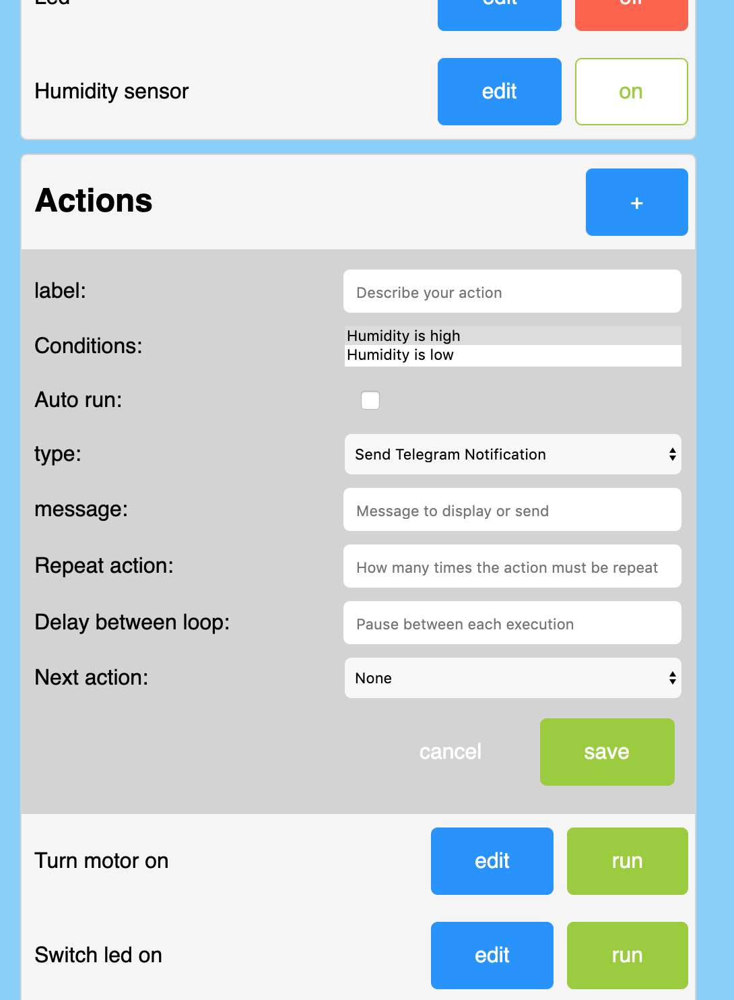
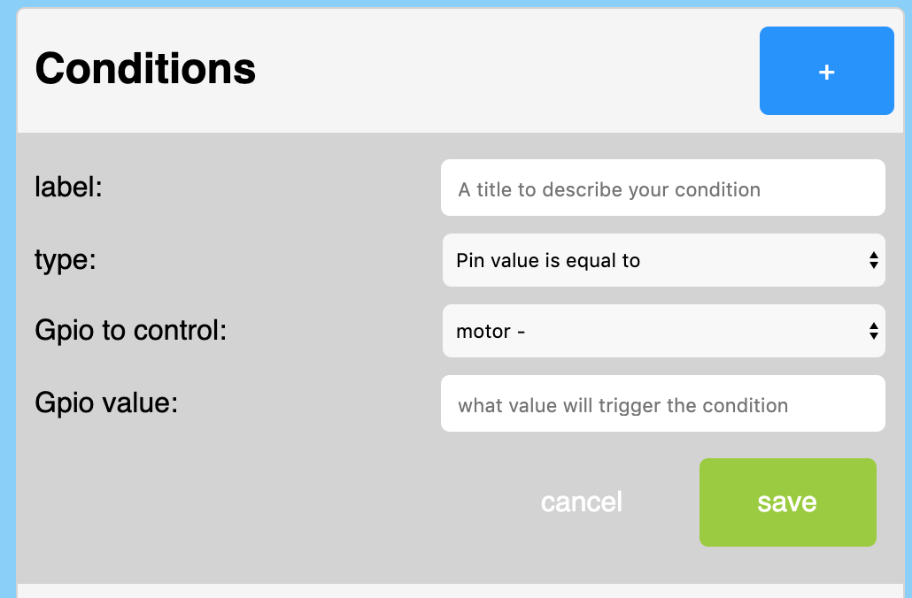

# ESPECIAL32 

This project aim to provide an easy way to control your esp32. You no longer need programming skills to set complex tasks.
Features:
- Automation: program actions that can be trigger via many different channels (api, mqtt, telegram bot or simply by pins events), without having to code. Control pins value, send telegram message, display messages etc. No need to update the firmware, everything is dynamic.
- Exposes digital pins and actions to a REST API: Set pin value, mode, if you want to store its state in flash. Trigger actions.
- Provide web interface full vanilla js. No internet connexion required. Pins mode, actions, conditions, telegram, everything can be set via the interface.
<div>
    
    
    
    
</div>

- Telegram bot: Access and control your esp32 from outside your home. No domotic server required! No port exposed to the outside world (way more secure than exposing your router ports). Restrict the access with a user authorised list.
<div>
    
</div>

- Mqtt client: publish/subscribe pin state, actions.
- Wifi manager: gives a way to easily set your esp32 to your network.
- Update: web server OTA. Directly in the web interface.
- Provides info on the tft LCD screen if you have one.

## Work in progress:
- Time based events: trigger actions based on time.
- Web Interface: Give it some love, fix some issues, particulary on mqtt connection
- Servo handler: Add the hability to control servo motors
- Add default and on/off values for pins.
## Wish list
- Unit and integration tests!! I'm really new in arduino and even c++ world, so I might need more time to work on that part.
- Find a suitable async web server. At the moment, the rest api is syncronous, one call at a time 😓, I'll make a branch with the ESPAsyncWebServer library, but I'm a bit concerned about the heap memory issue they keep having since 2018...
- Use websockets for the front. So that we don't need to refresh the page to get the updated pin states.
- Make this library compatible with other boards. For now it will only work with dual core boards, as the event listener for pin values is attached to the core 0. With some work, everything could be handle on one core. The main bottle neck is the UniversalTelegramBot library that seems to make long poll to Telegram api and therefor blocks the core process.
- Makefile/bash script: It would be great to have all dependencies easily compiled to the project.
- Auto update: from remote server (why not a .ini build on this repo?)
- reduce library dependencies: UniversalTelegramBot and WifiManager could be avoided. We might need to get rid of the tft library, as this code is too specific. 
## Getting Started

This code works well with [this](https://www.aliexpress.com/item/33048962331.html?spm=a2g0o.productlist.0.0.71ee316cmQo1JA&algo_pvid=6aadca0f-7463-41bf-8277-010dbd421b34&algo_expid=6aadca0f-7463-41bf-8277-010dbd421b34-6&btsid=0b0a0ae215834054133566008e89a2&ws_ab_test=searchweb0_0,searchweb201602_,searchweb201603_) type of chip from TTGO, but can work on any esp32. 

If your board uses a usb-c type port, you should be able to detect your board by installing this driver:
https://www.silabs.com/products/development-tools/software/usb-to-uart-bridge-vcp-drivers

### Prerequisites

Before installing anything you'll need your esp32 to be ready. This involve having installed an additional Arduino board manager. The process is quite easy and can be found in the following link:
https://github.com/espressif/arduino-esp32/blob/master/docs/arduino-ide/boards_manager.md

If you want to use vscode while coding (I strongly recommand it) follow this nice tutorial: https://medium.com/home-wireless/use-visual-studio-code-for-arduino-2d0cf4c1760b


### Installing

This code also has 5 dependencies which need to be added to your libraries:
- TFT_eSPI: (install via library manager) control your tft screen easily. Don't forget to choose the right setup in the User_setup_select.h of the library folder.
- ArduinoJSON v6 (install via library manager) Handle json in a very effective way.
- PubSubClient: (install via library manager)  MQTT handling. It's a very robust pubsub client, perfect for iot projects.
- WifiManager: https://github.com/tzapu/WiFiManager/tree/development
This library will allow you to easily set your board to your wifi. You'll need to get the development branch to have esp32 support.
- UniversalTelegramBot: https://github.com/RomeHein/Universal-Arduino-Telegram-Bot/tree/editMessage. Telegram api for arduino. This is a fork from the main repo. I've made a pull request but it's not yet accepted. So you'll need that fork to make this program works correctly.

## Usage

1. Wifi connection</br>
You should first connect your esp32 to your local network. This is easily done thanks to the WifiManager library. Simply power on your device, and connect to the access point (AP) provided. Its name should be the one you provided in the variable called `APName` at the begining of the main.ino file, you can of course change it. 
Once connected to the AP, a configuration window should appears. From here you can connect to your local network (the one provided by your rooter, internet box etc).
2. Connect to the web interface</br>
The ESP32 should now display its local IP on the tft screen. Simply enter the address provided on your favorite browser and enter.
You are now on the page directly served by your ESP32! The interface is responsive and should be usable on your smartphone.
It should look like this:
<p align="center">
    
</p>
You now need to add your first pin handler. This is done by simply clicking on the 'plus' button in the top right corner.
<p align="center">
    
</p>
Choose the pin you want to control/listen from the list. This list will only display available pins, so you won't have doublons 👌.
The 'save state' checkbox will allow you to save a state in the flash memory of the controller, allowing you to get back your state even after a reboot.
Once you are done with the settings, press 'save' to add the new GPIO.
A new line should appear:
<p align="center">
    
</p>
You can now control the state of your pin by pressing the 'on/off' button, or edit its configuration.
<br>
3. Automation!

And now the best part: set actions that will triggered based on gpios state or telegram/mqtt/api events!
This will give you infinite possibilities for controlling your esp32, without having to code or download new firmware.

First thing firts, you need to set conditions. For that, click on the add button on the top right corner of the condition section. This should open that panel:
<p align="center">
    
</p>
Here, you'll be able to set conditions based on gpios value. I'm sure there are tons of other possible types, but for now this is enough to cover a lot of use cases.
Name your condition, so that you can easily select it when we'll set our actions later on. Choose what type of condition (equal, greate or less than) and finally the gpio value.

Now we can set our first action. Simply click the add button in the action section:
<p align="center">
    
</p>
Automations are based on conditions. You can select multiple conditions. But keep in mind that in order to run, all conditions have to be true. 

If you select the auto run option, the action will be triggered whenever its conditions become true. This can be very handy if you want to send a Telegram notification when a gpio value changes.
You can simulate a `while` loop by setting the `repeat action` input. Just keep in mind that if you leave it empty or set it to 0, the action won't trigger. So set it to `1` at least.

You can specify a delay between each loop. Note that a long delay will block the process. 
Yes, actions run sequencially. The process maintain an actions queue where the oldest action queued is played first. So don't go crazy on that `delay` option 😉.

You can also specify the next action. This is very handy to easily program complex behaviours.

4. Use the rest API</br>
Once controls and actions added to your panel, you'll be able to trigger them by hitting the rest API: 

```
http://your.ip.local.ip/gpio/pinNumber/value
```
And set its state `on` with:
```
http://your.ip.local.ip/gpio/pinNumber/value/1
```
or `off`
```
http://your.ip.local.ip/gpio/pinNumber/value/0
```

And simply send:
```
http://your.ip.local.ip/automationtion/automationId
```
to run a specific action. Note that all conditions you have specified for than action must be fullfilled in order to execute it.

5. Set your Telegram Bot</br>
All this is cool, but what if you want to access/control your esp32 from outside your local network?
The easiest/safest way is [Telegram Bot](https://core.telegram.org/bots). You'll find on that [page](https://core.telegram.org/bots#6-botfather) how to create a Telegram Bot in 5 minutes.
Once created, and your bot token in good hands, just go back to your esp32 page and click the setting button. At the bottom of the page you should find the Telegram section, simply past your bot token here, and tick the active box.
Now say hello to your bot!
<p align="center">
    
</p>
When you first start the conversation with your bot, telegram will only display a `start` button. Tap it and if everything is ok, your bot should answer the available commands amongs your telegram id.
It's important to note that if you leave the authorised user list empty, your bot will answer to anyone. So be secure, and add at least one user id 😉

Now you're be able to control all pins in output mode by sending a `/gpios` or the actions you have set with `/actions`. The bot will answer a list of buttons corresponding to the list you've set on the web interface of the ESP32, sweet!

6. Set your MQTT client (advance)</br>
MQTT is a really nice pubsub protocol. I really encourage you to integrate this feature in your home automation. This allows a two ways communication between your home bridge and your iot device (here the esp32) in a very lightweight way.
To configure it, you'll need to enter the address of your MQTT broker aswell as your username and password for this broker.
You can then set the topic in which the pin states will be published.
The esp32 will listen for all pins on that topic like this:

```
mqtt://your.broker.address:port/yourTopic/friendlyName/gpios/pinNumber
```

It will also publish any state update on the same logic.

## Contributing

All kind of contributions are welcome. I'm very new to arduino world, so don't hesitate to give any advices

## Authors

* **Romain Cayzac** - *Initial work*

## License

This project is licensed under the GNU GPLv3 License - see the [LICENSE.md](LICENSE.md) file for details
