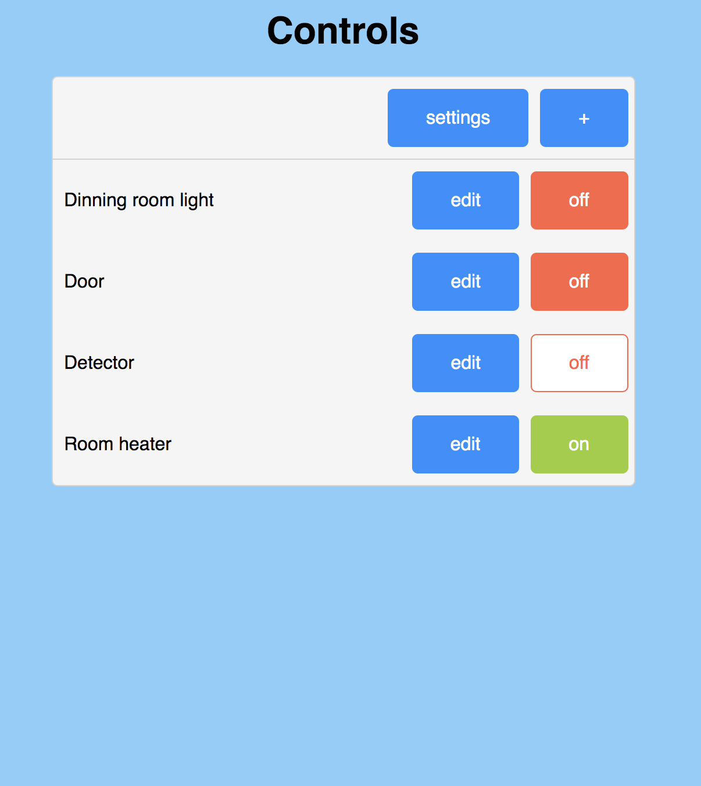

# TTGO ESP32 pin control server

This project aim to provide a server that can expose digital pins easily.
Features:
- Exposes digital pins to a REST API
- Provide web interface full vanilla js. No internet connexion required.

    
    
    

- Telegram bot: Access and control your esp32 from outside your home. No domotic server required!

    

- Wifi manager: gives a way to easily set your esp32 to your network
- Update: web server OTA.
- Provides info on the TTGO LCD screen
- Provides manual control over the pins thanks to the two buttons provided by the TTGO chip

## Work in progress:
- MQTT
- Documentation

## Wish list
- Makefile: It would be great to have all dependencies easily compiled to the project.
- Auto update: from remote server (why not puting a .ini build on github?)

## Getting Started

This code works well with this type of chip from TTGO: 
https://www.aliexpress.com/item/33048962331.html?spm=a2g0o.productlist.0.0.71ee316cmQo1JA&algo_pvid=6aadca0f-7463-41bf-8277-010dbd421b34&algo_expid=6aadca0f-7463-41bf-8277-010dbd421b34-6&btsid=0b0a0ae215834054133566008e89a2&ws_ab_test=searchweb0_0,searchweb201602_,searchweb201603_
but can easily be adapted to any other esp32 chip, especially if you remove the dependencies to the `TFT_eSPI` and `Button2` libraries.

### Prerequisites

Before installing anything you'll need your esp32 to be ready. This involve having installed an additional Arduino board manager. The process is quite easy and can be found in the following link:
https://github.com/espressif/arduino-esp32/blob/master/docs/arduino-ide/boards_manager.md

### Installing

This code also has 5 dependencies which need to be added to your libraries:
- WifiManager: https://github.com/tzapu/WiFiManager/tree/development
This library will allow you to easily set your board to your wifi.
- TFT_eSPI: https://github.com/Bodmer/TFT_eSPI
control your tft screen easily.
- Button2: https://github.com/LennartHennigs/Button2
an helper to use your onbard push buttons
- ArduinoJSON v6
- UniversalTelegramBot editMessage branch on this repo: https://github.com/RomeHein/Universal-Arduino-Telegram-Bot/tree/editMessage

## Contributing

All kind of contribution are welcome. I'm very new to arduino world, so don't hesitate to give any advices

## Authors

* **Romain Cayzac** - *Initial work*

## License

This project is licensed under the GNU GPLv3 License - see the [LICENSE.md](LICENSE.md) file for details

## Acknowledgments

* Hat tip to anyone whose code was used
* Inspiration
* etc
