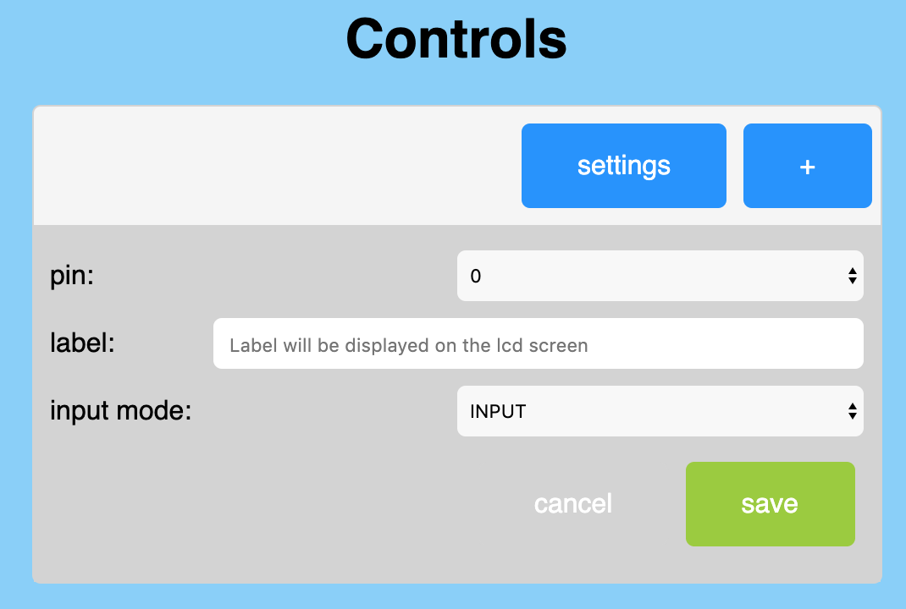
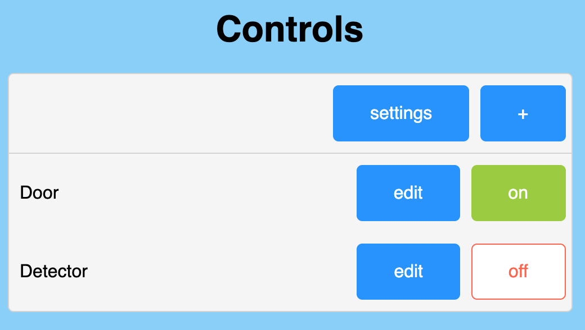

# ESP32 pin control server

This project aim to provide a server that can expose digital pins easily.
Features:
- Exposes digital pins to a REST API
- Provide web interface full vanilla js. No internet connexion required.
<div>
    
    
    
</div>

- Telegram bot: Access and control your esp32 from outside your home. No domotic server required! No port exposed to the outside world (way more secure than exposing your router ports)
<div>
    
</div>

- Wifi manager: gives a way to easily set your esp32 to your network.
- Update: web server OTA. Directly in the web interface.
- Provides info on the tft LCD screen.
- Provides manual control over the pins thanks to the two buttons provided by the TTGO chip.

## Work in progress:
- Web Interface

## Wish list
- Find a suitable async web server. At the moment, the rest api is syncronous, one call at a time 😓, I'll make a branch with the ESPAsyncWebServer library, but I'm a bit concerned about the heap memory issue they keep having since 2008...
- Makefile/bash script: It would be great to have all dependencies easily compiled to the project.
- Auto update: from remote server (why not a .ini build on this repo?)

## Getting Started

This code works well with [this](https://www.aliexpress.com/item/33048962331.html?spm=a2g0o.productlist.0.0.71ee316cmQo1JA&algo_pvid=6aadca0f-7463-41bf-8277-010dbd421b34&algo_expid=6aadca0f-7463-41bf-8277-010dbd421b34-6&btsid=0b0a0ae215834054133566008e89a2&ws_ab_test=searchweb0_0,searchweb201602_,searchweb201603_) type of chip from TTGO, but can easily be adapted to any other esp32 chip.

If your board uses a usb-c type port, you should be able to detect your board by installing this driver:
https://www.silabs.com/products/development-tools/software/usb-to-uart-bridge-vcp-drivers

### Prerequisites

Before installing anything you'll need your esp32 to be ready. This involve having installed an additional Arduino board manager. The process is quite easy and can be found in the following link:
https://github.com/espressif/arduino-esp32/blob/master/docs/arduino-ide/boards_manager.md

If you want to use vscode while coding (I strongly recommand it) follow this nice tutorial: https://medium.com/home-wireless/use-visual-studio-code-for-arduino-2d0cf4c1760b


### Installing

This code also has 6 dependencies which need to be added to your libraries:
- TFT_eSPI: (install via library manager) control your tft screen easily. Don't forget to choose the right setup in the User_setup_select.h of the library folder.
- ArduinoJSON v6 (install via library manager) Handle json in a very effective way.
- PubSubClient: (install via library manager)  MQTT handling. It's a very robust pubsub client, perfect for iot projects.
- Button2: (install via library manager) A easy way to handle buttons events
- WifiManager: https://github.com/tzapu/WiFiManager/tree/development
This library will allow you to easily set your board to your wifi. You'll need to get the development branch to have esp32 support.
- UniversalTelegramBot: https://github.com/RomeHein/Universal-Arduino-Telegram-Bot/tree/editMessage. Telegram api for arduino. This is a fork from the main repo. I've made a pull request but it's not yet accepted. So you'll need that fork to make this program works correctly.

## Usage

1. Wifi connection</br>
You should first connect your esp32 to your local network. This is easily done thanks to the WifiManager library. Simply power on your device, and connect to the access point (AP) provided. Its name should be the one you provided in the variable called `APName` at the begining of the main.ino file, you can of course change it. 
Once connected to the AP, a configuration window should appears. From here you can connect to your local network (the one provided by your rooter, internet box etc).
2. Connect to the web interface</br>
The ESP32 should now display its local IP on the tft screen. Simply enter the address provided on your favorite browser and enter.
You are now on the page directly served by your ESP32! The interface is responsive and should be usable on your smartphone.
It should look like this:
<p align="center">
    
</p>
You now need to add your first pin handler. This is done by simply clicking on the 'plus' button in the top right corner.
<p align="center">
    
</p>
Choose the pin you want to control/listen from the list. This list will only display available pins, so you won't have doublons 👌.
Press save when you are done.
A new line should appear:
<p align="center">
    
</p>
You can now control the state of your pin by pressing the 'on/off' button, or edit its configuration.

3. Use the rest API</br>
Once controls added to your panel, their states can be accessed by hitting the rest api: 


```
http://your.ip.local.ip/digital/pinNumber
```
And set its state `on` with:
```
http://your.ip.local.ip/digital/pinNumber/1
```
or `off`
```
http://your.ip.local.ip/digital/pinNumber/0
```

4. Set your Telegram Bot</br>
All this is cool, but what if you want to access/control your esp32 from outside your local network?
The easiest/safest way is [Telegram Bot](https://core.telegram.org/bots). You'll find on that [page](https://core.telegram.org/bots#6-botfather) how to create a Telegram Bot in 5 minutes.
Once created, and your bot token in good hands, just go back on your esp32 page and click the setting button. At the bottom of the page you should find the Telegram section, simple past your bot token here, and tick the active box.
Now say hello to your bot!
<p align="center">
    
</p>
When you first start the conversation with your bot, telegram will only display a `start` button. Tap it and if everything is ok, your bot should answer the available commands.
You'll be able to control all pins in output mode by sending a `/cmd`. The bot will answer a list of buttons corresponding to the list you've set on the web interface of the ESP32, sweet!

5. Set your MQTT client (advance)</br>
MQTT is a really nice pubsub protocol. I really encourage you to integrate this feature in your home automation. This allows a two ways communication between your home bridge and your iot device (here the esp32) in a very lightweight way.
To configure it, you'll need to enter the address of your MQTT broker aswell as your username and password for this broker.
You can then set the topic in which the pin states will be published.
The esp32 will listen for all pins on that topic like this:

```
mqtt://your.broker.address:port/yourTopic/friendlyName/gpios/pinNumber
```

It will also publish any state update on the same logic.

## Contributing

All kind of contributions are welcome. I'm very new to arduino world, so don't hesitate to give any advices

## Authors

* **Romain Cayzac** - *Initial work*

## License

This project is licensed under the GNU GPLv3 License - see the [LICENSE.md](LICENSE.md) file for details
